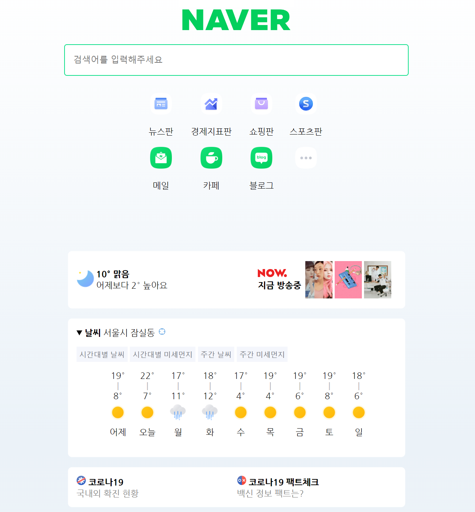

# Week 1

## Keyword
* Github + Coding Environment
* HTML
* CSS    

## What I learned
1. Git을 이용하여 파일의 버전 관리를 할 수 있습니다.
2. Github를 이용하여 파일을 업로드하고, 다른 사람들과 협업할 수 있습니다.
3. HTML을 이용하여 웹브라우저에 원하는 구조를 구현하고, 내용을 표시할 수 있습니다.
4. CSS를 이용하여 HTML 문서의 스타일을 지정할 수 있습니다.    

## Homework
* Week 1의 과제는 [사진](https://github.com/TEAMLAB-Lecture/web-development-curriculum/blob/aa67db448414052c2b9f9710a345b4d1a30204fa/Quest01/screen.png) 속의 화면을 HTML과 CSS를 이용하여 표현하는 과제입니다.

