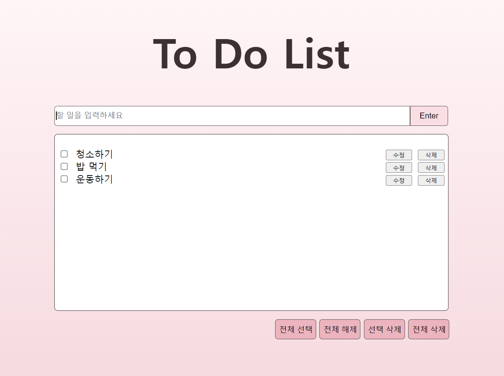

# Week 2

## Keyword
* JavaScript
* Jquery 

## What I learned
1. JavaScript를 이용하여 웹 페이지 내용 및 모양을 동적 제어할 수 있습니다.
2. 객체에 대한 개념을 이해하고 이를 활용할 수 있습니다.   
3. 이벤트를 이해하고 JavaScript로 처리할 수 있습니다.     
-> 더 자세한 내용은 [TIL](https://github.com/oooihmm/TIL.git)에서 확인하실 수 있습니다.

## Homework
* Week 2의 과제는 To Do List 구현하기 입니다.

