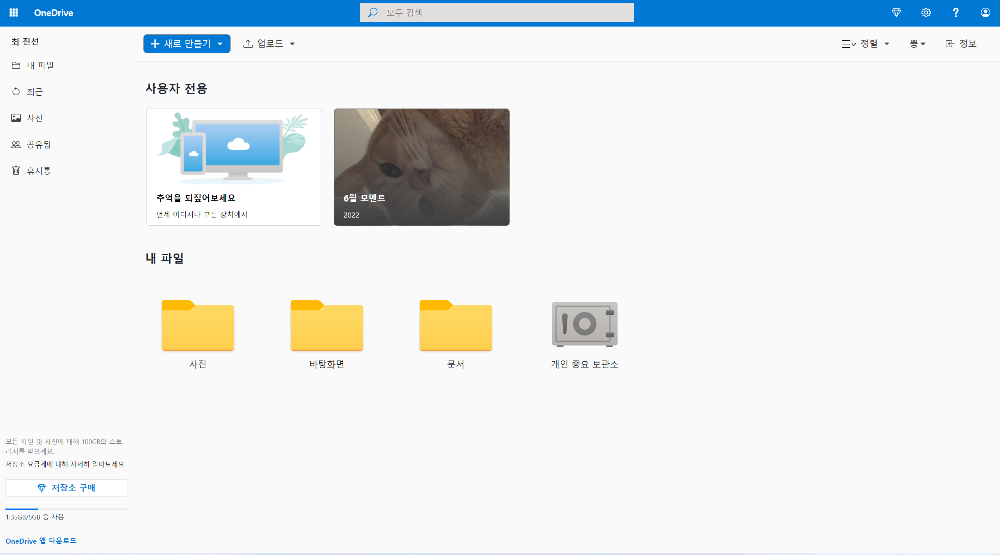

# Week 3

## Keyword
* Bootstrap
* Crawling
* Clone Coding

## What I learned
1. Bootstrap이 제공하는 프레임워크를 활용할 수 있습니다.
2. Python을 이용하여 원하는 정보를 크롤링할 수 있습니다.
3. HTML, CSS, JavaScript를 이용하여 실제 존재하는 서비스를 클론 코딩할 수 있습니다.  

## Homework
* Week 3의 과제는 OneDrive 클론 코딩 입니다.

